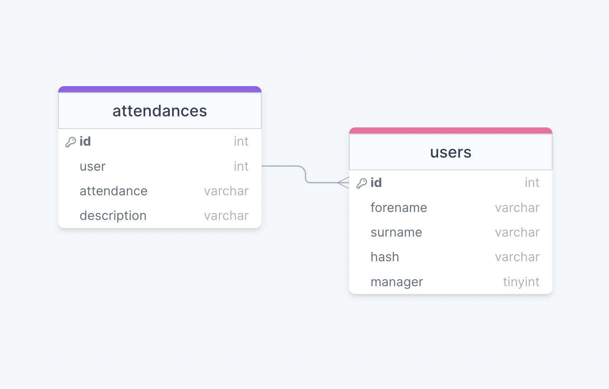
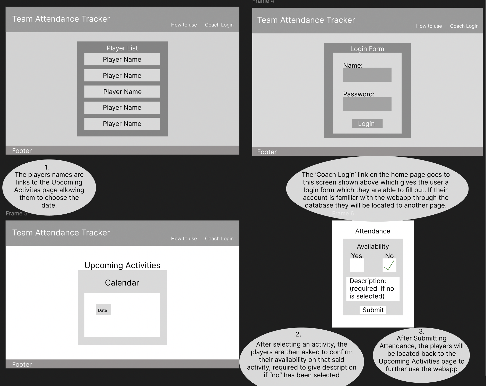
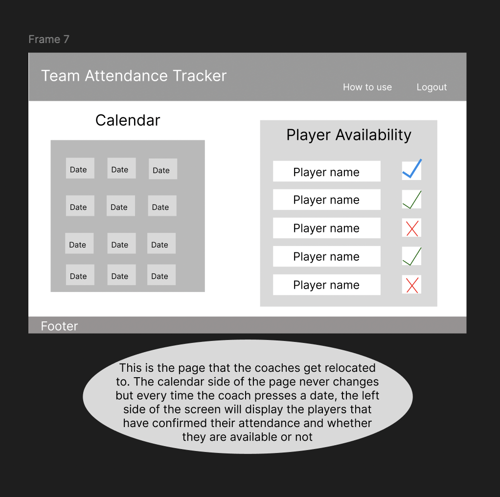

# The Design of a Database-Driven Web Application for NCEA Level 3

Project Name: **Team Attendance Tracker**

Project Author: **Coen Williams**

Assessment Standards: **91902** and **91903**

-------------------------------------------------

## System Requirements

### Identified Need or Problem

Junior A basketball players have different priorities outside of basketball. This can make it difficult for them to be able to make it to trainings, or games etc. Therefore the coach may not know who will be coming to what training/game. This can then effect the plan from the coach as they may have certain aspects of trainings or games that require a certain amount of people. 

### End-User Requirements

The junior boys in this situation are the players. These boys are always busy with school and other sports outside of basketball. These users will want the system to be very straight forward and presentable to them so they are able to select their attendance for each session without trouble.

The coach/manager will be able to access all of the players accounts, allowing them to view the attendance. This means the system will have to be simple for them to use. 

### Proposed Solution

A webapp for the Waimea Junior A basketball team that allows the players to view each session that is upcoming and select whether they will be able to make it to said session or not which they are required to give reasoning for.

The website will also allow the manager and coach to view each players attendance and add future sessions to the webapp allowing the Juniors to be able to focus on each new session.

Players should be able to:
- Identify themselves (via pin) 
- Confirm attendance (with description)

Coaches/Managers should be able to:
- Add future sessions
- View teams attendance

-------------------------------------------------
## Relevant Implications

### Functionality

The Functionality implication in a system relates to how well the design works based off the requirements of the end-user. The end-user should be talked to consistently for the webapp to be fully functional based on their terms.

I will need to ensure that my webapp is functional for the players as it will be built for them to approve their attendance easily with a description, therefore meaning it will need to be understandable and work for them. It also needs to be functional for the coach/manager as the purpose of this webapp is to allow them to see their players attendance with ease and no problems occurring.

Throughout the build of my webapp, i will be consulting with my end-user consistently often, therefore allowing me to get a better understanding of how they want this system to work in favour of functionality. We will make several changes to such system to ensure it is functional at a level they are not just pleased but satisfied with.

### Usability

The Usability implication in a system is how easy or difficult it may be for a user to access it. For example, usability can be studied through Nielsen's 10 Heuristics which contain things such as: Ensuring that the systems status is clear to the user, an easy understanding of the how the webapp works to the user, and keeping the webapp simple and straight forward.

I will need to make my system usable since my users are a mixture of younger aged and older aged citizens both apart of the same group having varying skill levels when it comes to webapp's therefore meaning my webapp needs to be simple and understandable to fit the needs of every user.

During the creation of my system, I will keep touch on the 10 Nielsen usability heuristics to ensure that the webapp is as usable as required. Resulting in a clean but appealing website that has everything in which is to be expected for the user. Users should easily be able to select attendance meaning I will in constant contact with my user to understand how to complete my design to their wants/needs.

### Aesthetic

Aesthetic implication in terms of a system or digital outcome is how it appeals by looks and design to the end-user. The user should be comfortable, not triggered with how the webpage is coloured and designed (layout).

To make my webapp aesthetically pleasing for my users, I will have to include both the players and the staff in my planning as this website needs to be satisfying for both party's in the way they will both be using them. For example, the color of the webapp will be mostly similar towards the different roles but things like the layout and certain other aspects of the webapp my be altered concerning whether it is a coach logged in to look at a attendance or a player logged in to change said attendance.

To ensure that my system has the aesthetic most suitable for my end-users, I will make a constant effort to give as many different prototypes of layouts as they need. Then from there, use their feedback on those said prototypes to then create a design comfortable for both the coach/manager and the players.

-------------------------------------------------
## Relevant User Experience (UX) Principles

### Accessibility

Ensuring that a product or a service is accessible to and usable for as many people as possible. Also, understanding how different environments and situational factors might impact the user experience.

This is relevant to my project as my web app needs to be able to reach out to everyone involved with my Junior team this year otherwise I wont be able to hear from everyone about their attendance. It also needs to understand different time situations like what trainings and games are available for them to say they are present or not for.

I will need to consider what is easier for my users for them to be able to get access to this webapp by talking to them about what device they are using. Also try and create a calendar feature on the web app that lets the players say present or not for about 2-3 weeks in the future.

### Consistency

Consistency is creating products that solve specific user problems. This keeps the design consistent on how they look and how the design functions across all screens.

This UX principle is relevant towards my project as my web app needs to consistently functional across multiple different screens and devices as most of the people using this web app will be using mobile phones, whilst I will be using it through a laptop to see who has used it.

I will need to consider the design of the webpage so it therefore allows the user to use different devices while the design stays consistent. To do this, I will need to console with my users to be able to understand a view that works for them.

### User-Freedom

User Freedom allows users that makes mistakes, which happens often, exit or go back therefore allowing them to undo their last action so they can go back to the systems previous state.

This UX principle is very useful towards my web app as my users will need to be able to undo a action if they were to accidentally click the wrong button or if they wanted to change what they had selected for their attendance as maybe something came up.

I will need to add a undo feature to this project therefore allowing the user to see the previous state of the webapp.

-------------------------------------------------
## Final System Design

### Database Structure

### User Interface Design

-------------------------------------------------

## Completed System

### Database Structure

Place a image here that shows the *actual database structure* that you implemented: tables, fields and relationships.

### User Interface Design

Place screenshots and notes here that show your *actual system UI* in action.

-------------------------------------------------

## Review and Evaluation

### Meeting the Needs of the Users

Replace this text with a brief evaluation of how well you met the needs of your users. Look at what you initially wrote about who they are, what specific needs they have, etc. and discuss how well the system meets those needs.

### Meeting the System Requirements

Replace this text with a brief evaluation of how well you met the requirements that you defined at the start of the project, etc. Look back at the list of features / functionality you initially set and discuss how well your system has implemented each one.

### Review of IMPLICATION NAME HERE

Replace this text with brief notes showing how the implication was addressed in the final outcome. Accompany the notes with screenshots / other media to illustrate specific features.

### Review of IMPLICATION NAME HERE

Replace this text with brief notes showing how the implication was addressed in the final outcome. Accompany the notes with screenshots / other media to illustrate specific features.

### Review of IMPLICATION NAME HERE

Replace this text with brief notes showing how the implication was addressed in the final outcome. Accompany the notes with screenshots / other media to illustrate specific features.

### Review of UX PRINCIPLE NAME HERE

Replace this text with brief notes showing how the UX principle was addressed in the final outcome. Accompany the notes with screenshots / other media to illustrate specific features.

### Review of UX PRINCIPLE NAME HERE

Replace this text with brief notes showing how the UX principle was addressed in the final outcome. Accompany the notes with screenshots / other media to illustrate specific features.

### Review of UX PRINCIPLE NAME HERE

Replace this text with brief notes showing how the UX principle was addressed in the final outcome. Accompany the notes with screenshots / other media to illustrate specific features.

