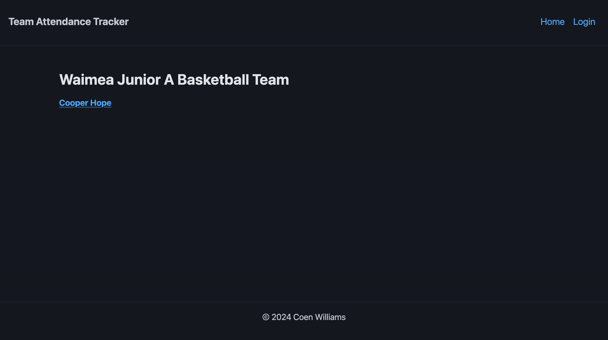
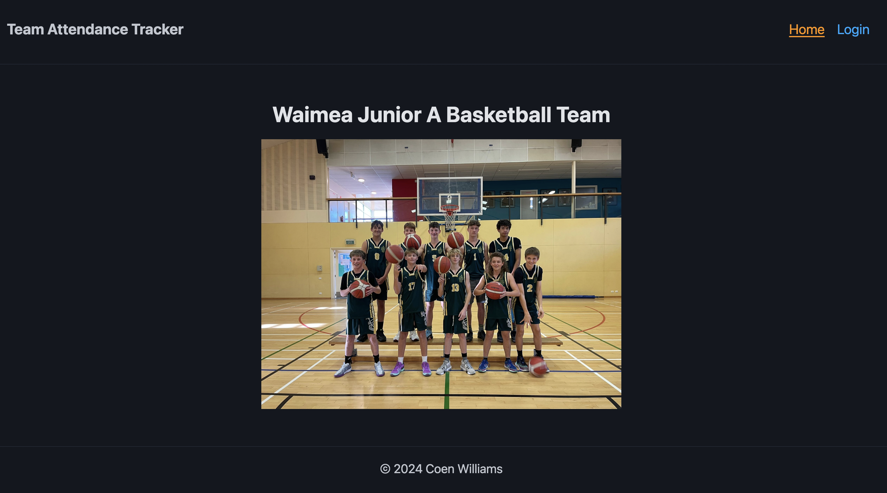

# Development of a Database-Driven Web Application for NCEA Level 3

Project Name: **Team Attendance Tracker**

Project Author: **Coen Williams**

Assessment Standards: **91902** and **91903**

-------------------------------------------------

## Design, Development and Testing Log

### DATE HERE

I am working on the layout of my home page.

I originally had the front page the list of all the players, which their names link to their attendance page where they can make changes to their attendance. I had a Coach Login on the top right of my page in the nav, only accessible to Admins. 

> My end-users, being my basketball players, all wished to have be able to login to an account to be able to adjust their attendance.

I therefore changed the view of the home page, which then meant the user has to now log-in, whether they are a coach/manager to be able to see all the players or if they are a player wanting to change their attendance. 

### DATE HERE

Replace this test with what you are working on

Replace this text with brief notes describing what you worked on, any decisions you made, any changes to designs, etc. Add screenshots / links to other media to illustrate your notes where necessary.

> Replace this text with any user feedback / comments

Replace this text with notes describing how you acted upon the user feedback: made changes to design, etc.

### DATE HERE

Replace this test with what you are working on

Replace this text with brief notes describing what you worked on, any decisions you made, any changes to designs, etc. Add screenshots / links to other media to illustrate your notes where necessary.

> Replace this text with any user feedback / comments

Replace this text with notes describing how you acted upon the user feedback: made changes to design, etc.

### DATE HERE

Replace this test with what you are working on

Replace this text with brief notes describing what you worked on, any decisions you made, any changes to designs, etc. Add screenshots / links to other media to illustrate your notes where necessary.

> Replace this text with any user feedback / comments

Replace this text with notes describing how you acted upon the user feedback: made changes to design, etc.

### DATE HERE

Replace this test with what you are working on

Replace this text with brief notes describing what you worked on, any decisions you made, any changes to designs, etc. Add screenshots / links to other media to illustrate your notes where necessary.

> Replace this text with any user feedback / comments

Replace this text with notes describing how you acted upon the user feedback: made changes to design, etc.

### DATE HERE

Replace this test with what you are working on

Replace this text with brief notes describing what you worked on, any decisions you made, any changes to designs, etc. Add screenshots / links to other media to illustrate your notes where necessary.

> Replace this text with any user feedback / comments

Replace this text with notes describing how you acted upon the user feedback: made changes to design, etc.
